# Options Insight – Quantitative Earnings Research Agent

<a href="https://options-insight.ravishankars.com/" target="_blank">
   
</a>
<a href="https://github.com/ravishan16/options-insight/issues">
   
</a>
<a href="https://github.com/ravishan16/options-insight/pulls">
   
</a>
<a href="https://github.com/ravishan16/options-insight/actions/workflows/ci.yml">
   
</a>
<a href="https://codecov.io/gh/ravishan16/options-insight">
   
</a>
<a href="https://github.com/ravishan16/options-insight/actions/workflows/deploy.yml">
   
</a>
<a href="LICENSE">
   
</a>
<a href="https://options-insight.ravishankars.com/" target="_blank">
   
</a>

## TL;DR

- **What it is:** Autonomous Cloudflare Worker that scans upcoming earnings, enriches with volatility and sentiment analysis, and delivers a newsletter via Resend.
- **Why it matters:** Retail options traders receive quantitative stats, AI commentary, and strategies every weekday morning.
- **Performance:** Yahoo Finance optimized architecture, sub-200ms quotes, 100% reliability, 69/69 passing tests.
- **Subscribe:** [options-insight.ravishankars.com](https://options-insight.ravishankars.com/).
- **What it is:** Options Insight gives retail traders an edge by automatically analyzing upcoming earnings, enriching them with volatility and sentiment data, and delivering a powerful, easy-to-read newsletter to your inbox every morning.
- **Why it matters:** Retail options traders get institutional-style prep without the manual grind—quantitative stats, AI commentary, and playbook-ready strategies arrive every weekday morning.
- **Performance:** Yahoo Finance optimized architecture delivering sub-200ms quotes with 100% reliability and 69/69 passing tests.
- **Subscribe:** Preview the latest briefing and join the list at [options-insight.ravishankars.com](https://options-insight.ravishankars.com/).

## Newsletter Sample


---

## Why this Exists

Options Insight automates the manual options workflow into a deterministic pipeline: scan > filter > analyze > narrate > publish. Traders get consistent, reviewable context.

---

## How the System Works (Optimized Pipeline)

1. **Market Radar:** Finnhub earnings calendar filtered to curated universe (`src/config.js`) and 1–45 day lookahead.
2. **Yahoo Finance Primary:** High-performance data provider, sub-200ms quotes, historical data, smart caching.
3. **Quant Analysis:** `simplified-data.js` calculates volatility, RSI, price ranges, and scores opportunities.
4. **AI Briefing:** Google Gemini generates strategy recommendations, validated in `gemini.js`.
5. **Professional Delivery:** React Email template, Resend broadcast, unsubscribe handling.

---

## Performance Architecture

### 🚀 Yahoo Finance Optimized

- **Primary Data Source:** Yahoo Finance (free, reliable, fast)
- **Quote Performance:** 67-255ms average
- **Historical Data:** 60-day volatility calculations
- **Caching:** 5-minute TTL for bulk ops
- **Rate Limiting:** 500ms delays

### 📊 Data Quality Metrics

- **Success Rate:** 100% Yahoo Finance reliability
- **Fallback Usage:** <1% (Finnhub rarely needed)
- **Real Data Coverage:** 100%
- **Test Coverage:** 69/69 tests passing, 95%+ core coverage

---

## Architecture at a Glance

```mermaid
flowchart TD
   classDef data fill:#F3E2D5,stroke:#B45F4D,stroke-width:1px,color:#3A3A3A
   classDef worker fill:#FDFDFD,stroke:#E4C590,stroke-width:1.6px,color:#3A3A3A
   classDef delivery fill:#DDBEA9,stroke:#B45F4D,stroke-width:1px,color:#3A3A3A
   classDef touch fill:#FAF6F0,stroke:#B45F4D,stroke-width:1px,color:#3A3A3A

   F["📅 Finnhub<br/>Earnings Calendar"]:::data
   Y["🚀 Yahoo Finance<br/>Quotes & Historical Data<br/>(Primary - 100% reliable)"]:::data
   FH["💼 Finnhub<br/>Quote Fallback<br/>(Rare usage)"]:::data
   G["🧠 Google Gemini<br/>Narrative AI"]:::data

   U["👤 Retail Trader<br/>Subscriber Persona"]:::touch
   Signup["📝 Signup Page<br/>Cloudflare Pages"]:::touch

   S["⏱ Scheduler & API<br/>(src/index.js)"]:::worker
   Sub["🛡 Subscribe Endpoint<br/>(POST /subscribe)"]:::worker
   P["📊 Opportunity Scan<br/>(src/finnhub.js)"]:::worker
   V["📈 Volatility Analysis<br/>(src/simplified-data.js)<br/>⚡ Cached & Optimized"]:::worker
   Q["✅ Quality Gates<br/>(validateAnalysis)"]:::worker
   T["🖋 Email Composer<br/>(src/email-template.js)"]:::worker

   Audience["📇 Resend Audience<br/>Contacts"]:::delivery
   R["✉️ Resend Broadcast"]:::delivery
   L["📥 Subscriber Inbox"]:::delivery
   Unsub["🚪 One-click Unsubscribe<br/>Resend-managed"]:::delivery

   F --> P
   Y --> V
   FH -.-> V
   P --> V --> Q --> T --> R --> L --> Unsub --> Audience
   G --> Q
   S --> P
   S --> R
   U --> Signup --> Sub --> Audience
```



Traders sign up via Cloudflare Pages, POST to `/subscribe`, join the Resend audience, and receive daily research with unsubscribe managed by Resend.

**Performance Highlights:**

- **Yahoo Finance:** Sub-200ms, 100% reliability
- **Smart Caching:** 5-min TTL
- **Graceful Fallbacks:** Finnhub backup
- **Real Data:** Historical volatility from market data

---

## Data & Intelligence Stack

| Layer | Service | Purpose | Performance Notes |
| --- | --- | --- | --- |
| Market Events | **Finnhub** | Earnings calendar & VIX quote | Free tier 60 calls/min; configured via `FINNHUB_API_KEY` |
| **Primary Data** | **Yahoo Finance** | **Quotes & historical volatility** | **100% reliable, sub-200ms response, no API limits** |
| Fallback Data | Finnhub | Quote backup | <1% usage rate; automatic failover |
| AI Narrative | **Google Gemini** | Sentiment, strategy articulation | Model: `gemini-pro-latest`; validated before inclusion |
| Delivery | **Resend** | Broadcast the React Email digest | Audience ID stored in secrets |
| Compute | **Cloudflare Workers** | Cron trigger, API endpoints, pipeline orchestration | Runs at 08:00 UTC weekdays (see `wrangler.toml`) |

### 🚀 Performance Optimizations

- **Yahoo Finance Primary:** 67-255ms average quote response time
- **Smart Caching:** 5-minute TTL reduces redundant API calls by ~80%
- **Rate Optimization:** 500ms delays = 58% faster bulk processing
- **Real Data Focus:** 100% historical volatility from actual market data (no estimates needed)

---

## Daily Research Workflow (Optimized Pipeline)

1. **Scan Universe:** `getEarningsOpportunities` pulls 45 days, filters tickers, scores timing/liquidity.
2. **Yahoo Finance Volatility:** `SimplifiedDataProvider` fetches quotes and volatility, cached.
3. **Quality Gate:** `volatilityScore` + `validateAnalysis` thresholds filter low-info names.
4. **Narrative Generation:** Gemini receives snapshot/context, returns structured brief.
5. **Rendering & Send:** `EmailTemplate` renders, `sendEmailDigest` sends via Resend.

Emoji-prefixed logs at each stage; see `make test-full-run` for transcript.

---

## Local Quickstart

### 1. Install Tooling

Node.js 20+ required.

```sh
npm install
```

### 2. Configure Secrets

Create `.env` for CLI and Make targets:

```bash
FINNHUB_API_KEY=your_finnhub_key
GEMINI_API_KEY=your_gemini_key
RESEND_API_KEY=your_resend_key
AUDIENCE_ID=your_resend_audience_id
TRIGGER_AUTH_SECRET=your_shared_secret
SUMMARY_EMAIL_RECIPIENT=********@gmail.com
# SIGNUP_ALLOWED_ORIGINS=https://options-insight.pages.dev,https://yourdomain.com
# SUMMARY_EMAIL_FROM=alerts@ravishankars.com
```

> **Rate-limit performance**
>
> - **Yahoo Finance:** No API limits, sub-200ms response times, 100% reliability
> - **Smart Caching:** 5-minute TTL reduces API calls by ~80% during bulk operations
> - **Finnhub:** 60 calls/min free tier—ample for daily earnings scans
> - **Optimized Delays:** 500ms between requests = 58% faster processing
> - **Gemini:** Quotas vary by account; failures default to skipping analysis so email still sends

### 3. Run Sanity Tests

```sh
make test-finnhub      # Earnings scan
make test-yahoo        # Quote + volatility pipeline
make test-email        # Render newsletter preview
```

### 4. Preview Newsletter Locally

```sh
make preview-email
open email-preview.html
```

---

## Operations Playbook

| Scenario | Command | Description |
| --- | --- | --- |
| End-to-end smoke | `make test-full-run` | Simulates scheduler + delivery locally |
| Component drill-down | `make test-<component>` | Finnhub, Yahoo, volatility, Gemini, email, scoring |
| Cron dev server | `make dev` | Boots Wrangler with endpoints |
| Force a run | `curl http://localhost:8787/cdn-cgi/handler/scheduled` | Mimics cron event |
| Manual trigger | `curl -X POST -H "x-trigger-secret: $TRIGGER_AUTH_SECRET" https://.../trigger` | Requires secret header |
| Review run summary | Automatic | Status email to `SUMMARY_EMAIL_RECIPIENT` |
| Public signup form | `pages/` | Static site posts to `/subscribe` |

Emoji logs announce each stage; Yahoo Finance successes show response times, Finnhub fallbacks are marked.

---

## Deploying to Cloudflare

1. **Push secrets:**

   ```sh
   make push-secrets
   ```

2. **Deploy:**

   ```sh
   make deploy
   ```

3. **Verify:**

   ```sh
   make verify-deployment
   ```

4. **Manual trigger:**

   ```sh
   make trigger-production
   ```

### Production Endpoints

- `GET /health` – Liveness probe
- `GET /status` – API key inventory (masked)
- `POST /trigger` – Run pipeline (requires `x-trigger-secret`)
- `POST /subscribe` – CORS-protected signup (accepts `SIGNUP_ALLOWED_ORIGINS`)

---

## Testing & Quality Assurance

High test coverage with unit and integration tests.

### Running Tests

```sh
npm test
npm run test:coverage
npm run test:watch
npm run test:ui
```

### Component Testing via CLI

```sh
# Individual component tests
make test-finnhub      # Earnings calendar data
make test-yahoo        # Volatility analysis with Yahoo Finance
make test-gemini       # AI analysis generation
make test-email        # Newsletter rendering
make preview-email     # Local newsletter preview

# Integration tests
make test-full-run     # End-to-end pipeline
```

### Coverage Thresholds

**80%+ coverage** for lines, functions, branches, statements. Reports uploaded to [Codecov](https://codecov.io/gh/ravishan16/options-insight).

---

## Roadmap & Next Bets

- **Performance Attribution:** Track realized vs. forecast volatility and POP accuracy.
- **Indicator Deepening:** Expand technical signals (ADX, ATR, skew).
- **Risk Guardrails:** Position sizing heuristics, capital at risk warnings.
- **Human-in-the-loop:** Optional review queue.
- **Portfolio Memory:** Persist recommendations for analytics.

---

## Contributing

See [contributing guide](CONTRIBUTING.md) for setup, standards, and review. Browse `good first issue` or open a discussion.

> **CI checks:** PRs run Wrangler dry-run compile (Node.js 20). Ensure `npx wrangler deploy --dry-run` succeeds before pushing.

---

## Security Policy

Report sensitive findings via [private security advisory](https://github.com/ravishan16/options-insight/security/advisories/new) or contact the maintainer. Acknowledge within 72 hours.

---

## License

Licensed under [MIT License](LICENSE). Contributions are covered by the same license.

---

## Compliance & Disclaimers

- Outputs are educational research, not investment advice.
- Options carry risk; confirm assumptions independently.
- Source code is open—preserve explanatory logging.

---

## Further Reading

- [Product Requirements Document](PRD.md)
- `src/` – Component implementations (`finnhub.js`, `simplified-data.js`, `gemini.js`, `email-template.js`)
