# Options Insight – Quantitative Earnings Research Agent

## TL;DR
- **What it is:** An autonomous Cloudflare Worker that scans upcoming earnings, enriches them with volatility and sentiment analysis, and delivers a polished newsletter via Resend.
- **Why it matters:** Retail options traders get institutional-style prep without the manual grind—quantitative stats, AI commentary, and playbook-ready strategies arrive every weekday morning.
- **Where to look next:** For feature-level details and roadmap, read the companion [Product Requirements Document](PRD.md).
- **Subscribe:** Preview the latest briefing and join the list at [options-insight.ravishankars.com](https://options-insight.ravishankars.com/).

---

## Why this Exists
The modern options workflow is still a patchwork of screeners, spreadsheets, and ad-hoc AI prompts. Options Insight packages that routine into a deterministic, reviewable pipeline. Every run follows the same recipe—scan > filter > analyze > narrate > publish—so traders start their day with context they can trust rather than intuition they have to second-guess.

---

## How the System Works (Narrative Flow)
1. **Market Radar** – Finnhub’s earnings calendar is filtered to a curated universe (`src/config.js`) and a 1–45 day lookahead window.
2. **Volatility Intelligence** – Alpha Vantage powers live quotes and (where available) historical vol. When premium endpoints are locked, the system transparently falls back to estimated ranges so the pipeline never stalls.
3. **Quant Scoring** – `real-volatility.js` calculates expected move, IV rank, and a composite volatility score that feeds opportunity ranking.
4. **AI Briefing** – Google Gemini transforms the quantitative bundle into human-friendly strategy notes, run through validation guards in `gemini.js`.
5. **Delivery** – A React Email template renders the briefing and Resend fires the broadcast to the preconfigured audience.

---

## Architecture at a Glance

```mermaid
flowchart TD
    classDef data fill:#F3E2D5,stroke:#B45F4D,stroke-width:1px,color:#3A3A3A
    classDef worker fill:#FDFDFD,stroke:#E4C590,stroke-width:1.6px,color:#3A3A3A
    classDef delivery fill:#DDBEA9,stroke:#B45F4D,stroke-width:1px,color:#3A3A3A

    F["📅 Finnhub<br/>Earnings Calendar"]:::data
    A["💹 Alpha Vantage<br/>Quotes & Volatility"]:::data
    G["🧠 Google Gemini<br/>Narrative AI"]:::data

    S["⏱ Scheduler & API<br/>(src/index.js)"]:::worker
    P["📊 Opportunity Scan<br/>(src/finnhub.js)"]:::worker
    V["📈 Volatility Analysis<br/>(src/real-volatility.js)"]:::worker
    Q["✅ Quality Gates<br/>(validateAnalysis)"]:::worker
    T["🖋 Email Composer<br/>(src/email-template.js)"]:::worker

    R["✉️ Resend Broadcast"]:::delivery
    L["📥 Subscriber Inbox"]:::delivery

    F --> P
    A --> V
    P --> V --> Q --> T --> R --> L
    G --> Q
    S --> P
    S --> R
```



The flow stays intentionally linear: structured market data and AI inputs feed the Cloudflare Worker pipeline, which stages scanning, volatility math, quality checks, and rendering before handing a finished briefing to Resend and the subscriber inbox.

---

## Data & Intelligence Stack

| Layer | Service | Purpose | Notes |
| --- | --- | --- | --- |
| Market Events | **Finnhub** | Earnings calendar & VIX quote | Free tier 60 calls/min; configured via `FINNHUB_API_KEY` |
| Volatility & Pricing | **Alpha Vantage** | Quotes, historical volatility, expected move | Free tier 25 calls/day; fallback estimators handle premium lockouts |
| AI Narrative | **Google Gemini** | Sentiment, strategy articulation | Model: `gemini-pro-latest`; validated before inclusion |
| Delivery | **Resend** | Broadcast the React Email digest | Audience ID stored in secrets |
| Compute | **Cloudflare Workers** | Cron trigger, API endpoints, pipeline orchestration | Runs at 08:00 UTC weekdays (see `wrangler.toml`) |

---

## Daily Research Workflow (Deep Dive)

1. **Scan Universe** – `getEarningsOpportunities` pulls 45 days of earnings, filters by curated tickers, and scores timing + liquidity.
2. **Volatility Analysis** – `getBulkVolatilityAnalysis` hydrates each candidate with IV, HV, expected move, and liquidity stats; estimate mode stays deterministic when real data is unavailable.
3. **Quality Gate** – Composite `qualityScore` + `validateAnalysis` thresholds keep low-information names out of the email.
4. **Narrative Generation** – Gemini receives the quantitative snapshot plus market regime context (`getMarketContext`) and returns a structured brief.
5. **Rendering & Send** – `EmailTemplate` renders the cards, and `sendEmailDigest` publishes through Resend.

Logging across each stage (prefixed with emoji) makes full-run transcripts easy to read—see `make test-full-run` output for an end-to-end rehearsal.

---

## Local Quickstart

### 1. Install Tooling
Ensure you are running **Node.js 20 or newer** (Wrangler and the Worker runtime require it).

```sh
npm install
```

### 2. Configure Secrets
Create `.env` (used by the CLI and Make targets):

```bash
FINNHUB_API_KEY=your_finnhub_key
ALPHA_VANTAGE_API_KEY=your_alpha_key
GEMINI_API_KEY=your_gemini_key
RESEND_API_KEY=your_resend_key
AUDIENCE_ID=your_resend_audience_id
TRIGGER_AUTH_SECRET=your_shared_secret
SUMMARY_EMAIL_RECIPIENT=********@gmail.com
# Optional: restrict who can call POST /subscribe (comma-separated origins)
# SIGNUP_ALLOWED_ORIGINS=https://options-insight.pages.dev,https://yourdomain.com
# Optional override (defaults to alerts@ravishankars.com)
# SUMMARY_EMAIL_FROM=alerts@ravishankars.com
```

> **Rate-limit snapshot**
> - Alpha Vantage free tier allows 25 calls/day. The worker staggers calls (15 s gaps) and falls back to calibrated estimates when premium data is locked.
> - Finnhub free tier handles 60 calls/min—ample for daily scans.
> - Gemini quotas vary by account; failures default to skipping the analysis so the email still sends.

### 3. Run Sanity Tests
```sh
make test-finnhub      # Earnings scan
make test-alphavantage # Quote + volatility pipeline
make test-email        # Render newsletter preview
```

### 4. Preview the Newsletter Locally
```sh
make preview-email
open email-preview.html
```

---

## Operations Playbook

| Scenario | Command | Description |
| --- | --- | --- |
| End-to-end smoke | `make test-full-run` | Simulates scheduler + delivery locally (uses rate-limit delays) |
| Component drill-down | `make test-<component>` | Finnhub, Alpha Vantage, volatility, Gemini, email, scoring |
| Cron dev server | `make dev` | Boots Wrangler with `/health`, `/status`, `/trigger` endpoints |
| Force a run (local Wrangler) | `curl http://localhost:8787/cdn-cgi/handler/scheduled` | Mimics the Cloudflare cron event |
| Authorized manual trigger | `curl -X POST -H "x-trigger-secret: $TRIGGER_AUTH_SECRET" https://.../trigger` | Requires shared secret header |
| Review run summary | Automatic | Every run sends a status email (success/errors, metrics) to `SUMMARY_EMAIL_RECIPIENT` via Resend |
| Public signup form | `pages/` | Static Cloudflare Pages site that posts to `/subscribe` and adds contacts to the configured Resend audience |

Logs intentionally announce every stage. When Alpha Vantage returns premium notices, you’ll see the fallback estimation path in the transcript.

---

## Deploying to Cloudflare

1. **Push secrets** – Copies `.env` values into Worker secrets:
   ```sh
   make push-secrets
   ```
2. **Deploy** – Publish the worker and schedule:
   ```sh
   make deploy
   ```
3. **Verify** – Health checks and config audit:
   ```sh
   make verify-deployment
   ```
4. **Manual trigger** – Useful during smoke testing (requires `TRIGGER_AUTH_SECRET` to be set locally):
   ```sh
   make trigger-production
   ```

### Production Endpoints
- `GET /health` – Liveness probe
- `GET /status` – API key inventory (masked) + readiness flag
- `POST /trigger` – Run the full pipeline on demand (requires `x-trigger-secret` header matching `TRIGGER_AUTH_SECRET`)
- `POST /subscribe` – CORS-protected endpoint for the Cloudflare Pages signup form. Only accepts requests from `SIGNUP_ALLOWED_ORIGINS` (defaults include local dev + Pages preview)

### Cloudflare Pages Signup Flow

The `/pages` directory contains a lightweight, branded signup experience that talks to the Worker’s `/subscribe` endpoint.

1. **Preview locally** – Open `pages/index.html` directly in the browser or serve it with any static HTTP server.
2. **Configure allowed origins** – Set `SIGNUP_ALLOWED_ORIGINS` in `.env` (comma-separated) and run `make push-secrets` so only trusted hosts can call `/subscribe`.
3. **Deploy to Cloudflare Pages** – Point a Pages project at the repository (directory `pages/`), or upload the contents manually. Cloudflare assigns a production domain like `https://options-insight-signup.pages.dev` and per-commit preview URLs (e.g. `https://<hash>.options-insight-signup.pages.dev`). The form auto-detects the production API and falls back to the default Worker URL.
4. **Unsubscribe support** – Resend automatically injects `{{{ unsubscribe_url }}}` into the React Email footer, so every broadcast includes a first-party opt-out link.

> **CI automation:** The `Deploy Cloudflare Pages Signup` GitHub Action now builds preview deployments for pull requests (surfacing the URL in the Actions log) and pushes the `pages/` directory to your Cloudflare Pages project (`options-insight-signup` by default) on every merge to `main`. Configure the same `CLOUDFLARE_ACCOUNT_ID`/`CLOUDFLARE_API_TOKEN` secrets used for the Worker and grant the token Pages access.

> **Manual deploy:** Run `make deploy-pages` to publish from your local machine. Override the project name with `PROJECT_NAME=your-pages-project make deploy-pages` if you use a different name.

> **Note:** The signup form collects `email` (required) and `firstName` (optional) and tags the contact with the acquisition source in Resend. Submissions from disallowed origins return a 403 with a descriptive error.

### Brand palette

The public signup page mirrors the warm palette from [ravishankars.com](https://ravishankars.com/). Key CSS variables (see `pages/styles.css`) include:

| Variable | Hex | Description |
| --- | --- | --- |
| `--bg` | `#FAF6F0` | Ivory Linen background |
| `--surface` | `#FDFDFD` | Porcelain cards and surfaces |
| `--text` | `#3A3A3A` | Charcoal Plum headings |
| `--muted` | `#7C6F64` | Warm Taupe body copy |
| `--primary` | `#DDBEA9` | Soft Clay buttons and accents |
| `--primary-dark` | `#B45F4D` | Terracotta hover state |
| `--border`/`--accent` | `#E4C590` | Gold Sand dividers, tags, and pill outlines |

Use the same variables when extending the marketing experience to keep the Properties brand consistent.

---

## Testing Matrix

```sh
# Component-level
make test-finnhub
make test-alphavantage
make test-volatility
make test-gemini
make test-email
make test-scoring

# Integration
make test-pipeline
make test-full-run

# Debugging
make debug-run        # Verbose logging across the stack
make test-stock SYMBOL=AAPL
```

---

## Roadmap & Next Bets
Directly aligned with the PRD:

- **Performance Attribution** – Track realized vs. forecast volatility and POP accuracy.
- **Indicator Deepening** – Expand the technical signal set (ADX, ATR trend, skew).
- **Risk Guardrails** – Incorporate position sizing heuristics and capital at risk warnings.
- **Human-in-the-loop** – Optional review queue before broadcasting.
- **Portfolio Memory** – Persist historical recommendations for analytics dashboards.

---

## Contributing

Community improvements are welcome! Please read the [contributing guide](CONTRIBUTING.md) for setup instructions, coding standards, and the review process. If you are unsure where to start, browse open issues labeled `good first issue` or open a discussion to propose an idea.

> **CI checks**: Every pull request runs an automated Wrangler dry-run compile on GitHub Actions (Node.js 20). Please make sure `npx wrangler deploy --dry-run` succeeds locally before pushing.

> **Run notifications**: After each scheduled or manual execution the worker emails a summary (status, metrics, warnings, and errors) to `SUMMARY_EMAIL_RECIPIENT` using Resend. Set this in your environment or accept the default maintainer address.

## Security Policy

Sensitive findings should **not** be reported through public issues. Instead, open a [private security advisory](https://github.com/ravishan16/options-insight/security/advisories/new) with detailed reproduction steps, or contact the maintainer directly via the email address on their GitHub profile. We will acknowledge reports within 72 hours.

## License

This repository is licensed under the [MIT License](LICENSE). When contributing, you agree that your submissions will be covered by the same license.

---

## Compliance & Disclaimers
- Outputs are educational quantitative research, not individualized investment advice.
- Options carry significant risk of loss; always confirm assumptions independently.
- Source code is open for transparency—contributions should preserve explanatory logging.

---

## Further Reading
- [Product Requirements Document](PRD.md) – Full background, success metrics, and future roadmap.
- `src/` – Component implementations referenced above (`finnhub.js`, `real-volatility.js`, `gemini.js`, `email-template.js`).
